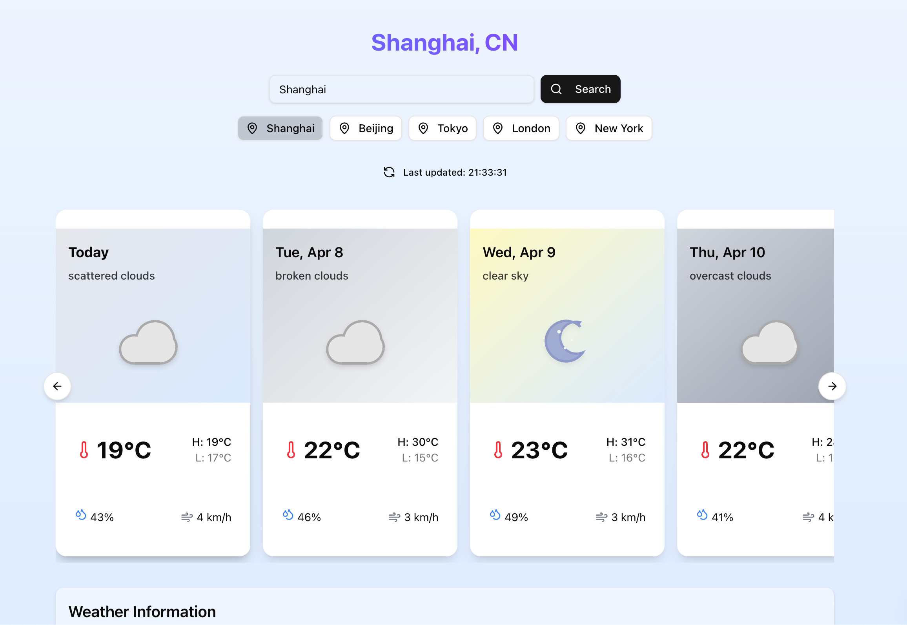

# 天气预报应用

一个美观、响应式的天气预报应用，基于Next.js和OpenWeatherMap API构建，提供全球城市7天天气预报。



## 功能特点

- 7天天气预报数据展示
- 全球城市搜索功能
- 响应式设计，适配移动端和桌面端
- 动态天气背景和图标
- 详细的天气信息（温度、湿度、风速等）
- 直观的用户界面

## 技术栈

- **前端框架**: [Next.js](https://nextjs.org/) (React框架)
- **样式**: [Tailwind CSS](https://tailwindcss.com/) 和 [shadcn/ui](https://ui.shadcn.com/)
- **API**: [OpenWeatherMap API](https://openweathermap.org/api)
- **状态管理**: React Hooks (useState, useEffect)
- **HTTP客户端**: Axios
- **部署**: Vercel/Netlify (推荐)

## 快速开始

### 前提条件

- Node.js 16.x 或更高版本
- npm 或 yarn 或 pnpm
- OpenWeatherMap API密钥 (可在[这里](https://home.openweathermap.org/api_keys)获取)

### 安装步骤

1. 克隆仓库

   ```bash
   git clone https://github.com/mirror29/weather-app.git
   cd weather-app
   ```
2. 安装依赖

   ```bash
   npm install
   # 或者
   yarn
   # 或者
   pnpm install
   ```
3. 创建环境变量文件

   ```bash
   cp env.example .env.local
   ```
4. 在 `.env.local`文件中添加您的OpenWeatherMap API密钥

   ```
   OPENWEATHER_API_KEY=your_api_key_here
   ```
5. 启动开发服务器

   ```bash
   npm run dev
   # 或者
   yarn dev
   # 或者
   pnpm dev
   ```
6. 在浏览器中打开 [http://localhost:3000](http://localhost:3000)

### 生产环境构建

```bash
npm run build
npm start
# 或者
yarn build
yarn start
# 或者
pnpm build
pnpm start
```

## 项目结构

```
weather-app/
├── public/                  # 静态资源
│   └── weather-icons/       # 天气图标
├── src/                     # 源代码
│   ├── app/                 # Next.js App Router
│   │   ├── api/             # API路由
│   │   │   └── weather/     # 天气API端点
│   │   └── page.tsx         # 主页
│   ├── components/          # React组件
│   │   ├── Weather.tsx      # 天气组件
│   │   └── WeatherCard.tsx  # 天气卡片组件
│   └── lib/                 # 工具函数
│       └── weatherApi.ts    # 天气API客户端
└── README.md                # 项目文档
```

## 自定义配置

### 天气图标

应用使用SVG图标来展示不同的天气状况。图标文件位于 `public/weather-icons/`目录下。您可以替换这些图标以自定义外观。

### API配置

默认情况下，应用使用OpenWeatherMap API。您可以在 `src/app/api/weather/route.ts`中修改API配置，例如单位（公制/英制）。

## 部署

该应用可以轻松部署到Vercel或Netlify等平台。部署时，确保设置以下环境变量：

```
OPENWEATHER_API_KEY=your_api_key_here
```

## 贡献指南

欢迎贡献！请随时提交Pull Request或创建Issue。

## 许可证

MIT
